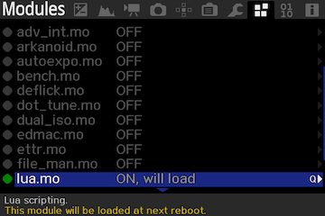
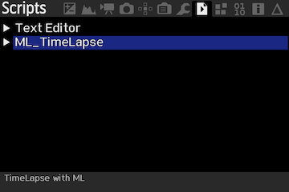
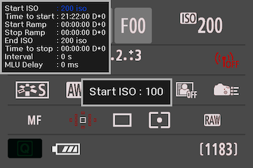
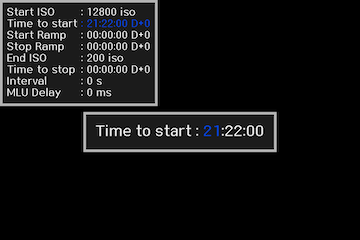
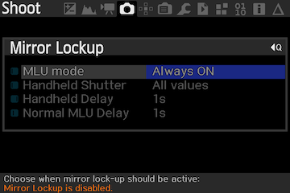

# Projet ML_TimeLapse
## TimeLapse avec Magic Lantern  

Exécution d'un cycle de photos pour réaliser un time-lapse avec la gestion du passage du jour à la nuit.  
Qualifié avec un Canon 6D et un 60D.  

## Principe de fonctionnement
Le programme ML_TimeLapse.lua va réaliser une série de photos avec un cycle défini par l'utilisateur.  
Il est exécuté par l'application Magic Lantern. Les informations sur Magic Lantern sont données dans le chapitre suivant.

## Magic Lantern
Installer Magic Lantern sur votre boitier.  
https://www.magiclantern.fm/index.html  
Attention ! Il faut activer le module lua "Lua scripting" dans le menu Modules de MagicLantern.  
  
Copier le script ML_TimeLapse.lua dans le répertoire ML/SCRIPTS de la carte SD.

## Lancement de l'application
* Choisir le menu script.  
* Déplacer la barre de sélection sur le choix ML_TimeLapse.  
* Lancer l'application avec la touche SET.


Menu Scripts  


# Utilisation de l'application
Une fois lancée l'application affiche, en haut à droite, un tableau récapitulatif des paramètres.



Au milieu se fait la saisie des paramètres du cycle de prise de vues.



Le déplacement sur les digits se fait avec les touches Droite et Gauche.  
Le changement de valeur se fait avec les touches Haut et Bas.  
La touche Set valide la valeur.  
La touche Q permet de sortir de l'application sans lancer le cycle.  

# Paramétrage du boitier
Le boitier doit être en mode :
* Auto power off à Disable
* Mode Manuel
* Auto Focus en off

## Attention ! 
Le temps minimum entre deux images est de 1s.

## Mirror Lockup
Si le boitier le permet il est possible d'utiliser le Mirrorlockup. Cela permet d'éviter des vibrations pendant la prise de vue.  
Menu Shoot - Mirror Lockup  
  
La configuration MLU Mirror Lockup est pilotée par le script mais il est possible qu'elle ne soit pas acceptée. 

# Configurations
## Mode test
Pour tester le script il est possible d'utiliser le mode Test. Ce mode déroule le script normalement mais ne déclenche pas les photos.  
Pour activer/désactiver ce mode, modifier le champ TestMode dans la ligne Config.
* 0 => mode réel  
* 1 => mode test

# Fichier log
A chaque lancement de séquence, un fichier log __MLTL.LOG__ est créé à la racine de la carte SD.  
Toutes les actions de la séquence sont tracées dans le fichier.
```
===============================================================================
ML/SCRIPTS/ML_TIM~1.LUA - 2020-9-13 22:03:44
===============================================================================

==> ML_TimeLapse.lua - Version : 1.0.3 
22:03:44 - Log begin.
22:03:44 - get init parameter iso at 6400
22:03:46 - Apply init parameter iso at 6400
22:03:46 - Table iso updated with 22 arguments
22:03:46 - ISO Table = 22 values
22:03:52 - Get Start ISO value : 100 index : 1
22:04:05 - Get Time to start at 22:05:00
22:04:06 - Start at 79500s and 100 ISO
22:04:08 - Get Start Ramp at 22:06:00
22:04:11 - Get Stop Ramp at 22:07:00
22:04:17 - Get End ISO value : 6400 index : 19
22:04:17 - Ramping Start at 79560s and finish at 79620s with 6400 ISO
22:04:24 - Get Time to stop at 22:08:00
22:04:24 - End at 79680s
22:04:30 - Get Interval value : 10 index : 10
22:04:32 - Get MLU Delay value : 0 index : 1
22:04:32 - Interval = 10s and MLU Delay = 0ms
22:04:32 - Start at 79500s and 100 ISO
22:04:32 - Start with Interval = 10s, MLU = 0ms
22:04:32 - Ramp at : 79560s and finish at : 79620s with 6400 ISO
22:04:32 - End at : 79680s 
22:05:01 - Get Start ? : Yes
22:05:01 - Start sequence ! 
22:05:01 - Set mirror lockup OFF.
22:05:01 - Relativ : Zero : 92 Start : -1 Startramp : 59 Stopramp : 119 Stop : 179
22:05:01 - Duration = To go : -1 Start : 60 Ramp : 60 Stop : 60
22:05:01 - NO Shoot! ISO: 100 Aperture: 0 shutter: 1 Test Mode

```